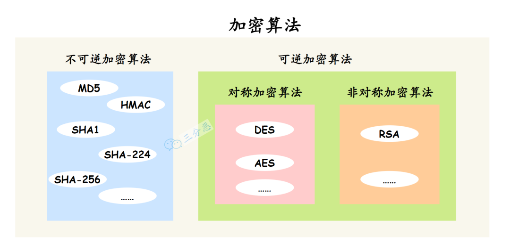

# 常用加密算法

大家平时的工作中，可能也在很多地方用到了加密、解密，比如：

- 用户的密码不能明文存储，要存储加密后的密文
- 用户的银行卡号、身份证号之类的敏感数据，需要加密传输
- 还有一些重要接口，比如支付，客户端要对请求生成一个签名，服务端要对签名进行验证
- ……


那么上面提到的这些能力，我们都可以利用哪些加密算法来实现呢？咱们接着往下看。

# 常见加密算法

算法整体上可以分为**不可逆加密**，以及**可逆加密**，可逆加密又可以分为**对称加密**和**非对称加密**。

加密算法分类

## 不可逆算法

不可逆加密的算法的加密是不可逆的，密文无法被还原成原文。

散列算法，就是一种不可逆算法。散列算法中，明文通过散列算法生成散列值，散列值是长度固定的数据，和明文长度无关。

散列算法

散列算法的具体实现有很多种，常见的包括MD5、SHA1、SHA-224、SHA-256等等。

散列算法常用于数字签名、消息认证、密码存储等场景。

散列算法是不需要密钥的，当然也有一些不可逆算法，需要密钥，例如HMAC算法。

### MD5

MD5，全称为“Message-Digest Algorithm 5”，翻译过来叫“信息摘要算法”。它可以将任意长度的数据通过散列算法，生成一个固定长度的散列值。MD5算法的输出长度为128位，通常用32个16进制数表示。

我们来看下MD5算法的Java代码实现：

```java
public class MD5 {
    private static final String MD5_ALGORITHM = "MD5";
    public static String encrypt(String data) throws Exception {
        // 获取MD5算法实例
        MessageDigest messageDigest = MessageDigest.getInstance(MD5_ALGORITHM);
        // 计算散列值
        byte[] digest = messageDigest.digest(data.getBytes());
        Formatter formatter = new Formatter();
        // 补齐前导0，并格式化
        for (byte b : digest) {
            formatter.format("%02x", b);
        }
        return formatter.toString();
    }

    public static void main(String[] args) throws Exception {
        String data = "Hello World";
        String encryptedData = encrypt(data);
        System.out.println("加密后的数据：" + encryptedData);
    }
}
```

MD5有一些优点，比如计算速度快、输出长度固定、应用广泛等等。

但是作为一个加密算法，它有一个天大的缺点，那就是`不安全`。

MD5算法已经被攻破，而且MD5算法的输出长度有限，攻击者可以通过暴力破解或彩虹表攻击等方式，找到与原始数据相同的散列值，从而破解数据。

虽然可以通过加盐，也就是对在原文里再加上一些不固定的字符串来缓解，但是完全可以用更安全的SHA系列算法替代。

### SHA-256

SHA（Secure Hash Algorithm）系列算法是一组密码散列函数，用于将任意长度的数据映射为固定长度的散列值。SHA系列算法由美国国家安全局（NSA）于1993年设计，目前共有SHA-1、SHA-2、SHA-3三种版本。

其中SHA-1系列存在缺陷，已经不再被推荐使用。

SHA-2算法包括`SHA-224`、`SHA-256`、`SHA-384`和`SHA-512`四种散列函数，分别将任意长度的数据映射为224位、256位、384位和512位的散列值。

我们来看一下最常用的`SHA-256`的Java代码实现：

```java
public class SHA256 {
    private static final String SHA_256_ALGORITHM = "SHA-256";
    public static String encrypt(String data) throws Exception {
        //获取SHA-256算法实例
        MessageDigest messageDigest = MessageDigest.getInstance(SHA_256_ALGORITHM);
        //计算散列值
        byte[] digest = messageDigest.digest(data.getBytes());
        StringBuilder stringBuilder = new StringBuilder();
        //将byte数组转换为15进制字符串
        for (byte b : digest) {
            stringBuilder.append(Integer.toHexString((b & 0xFF) | 0x100), 1, 3);
        }
        return stringBuilder.toString();
    }

    public static void main(String[] args) throws Exception {
        String data = "Hello World";
        String encryptedData = encrypt(data);
        System.out.println("加密后的数据：" + encryptedData);
    }
}
```

SHA-2算法之所以比MD5强，主要有两个原因：

- 散列值长度更长：例如SHA-256算法的散列值长度为256位，而MD5算法的散列值长度为128位，这就提高了攻击者暴力破解或者彩虹表攻击的难度。
- 更强的碰撞抗性：SHA算法采用了更复杂的运算过程和更多的轮次，使得攻击者更难以通过预计算或巧合找到碰撞。

当然，SHA-2也不是绝对安全的，散列算法都有被暴力破解或者彩虹表攻击的风险，所以，在实际的应用中，加盐还是必不可少的。

加盐

## 对称加密算法

对称加密算法，使用同一个密钥进行加密和解密。

对称加密算法

加密和解密过程使用的是相同的密钥，因此密钥的安全性至关重要。如果密钥泄露，攻击者可以轻易地破解加密数据。

常见的对称加密算法包括DES、3DES、AES等。其中，AES算法是目前使用最广泛的对称加密算法之一，具有比较高的安全性和加密效率。

### DES

DES（Data Encryption Standard）算法是一种对称加密算法，由IBM公司于1975年研发，是最早的一种广泛应用的对称加密算法之一。

DES算法使用56位密钥对数据进行加密，加密过程中使用了置换、替换、异或等运算，具有较高的安全性。

我们来看下DES算法的Java代码实现：

```java
public class DES {
    private static final String DES_ALGORITHM = "DES";

    /**
     * DES加密
     *
     * @param data 待加密的数据
     * @param key  密钥，长度必须为8位
     * @return 加密后的数据，使用Base64编码
     */
    public static String encrypt(String data, String key) throws Exception {
        // 根据密钥生成密钥规范
        KeySpec keySpec = new DESKeySpec(key.getBytes());
        // 根据密钥规范生成密钥工厂
        SecretKeyFactory secretKeyFactory = SecretKeyFactory.getInstance(DES_ALGORITHM);
        // 根据密钥工厂和密钥规范生成密钥
        SecretKey secretKey = secretKeyFactory.generateSecret(keySpec);

        // 根据加密算法获取加密器
        Cipher cipher = Cipher.getInstance(DES_ALGORITHM);
        // 初始化加密器，设置加密模式和密钥
        cipher.init(Cipher.ENCRYPT_MODE, secretKey);
        // 加密数据
        byte[] encryptedData = cipher.doFinal(data.getBytes());
        // 对加密后的数据进行Base64编码
        return Base64.getEncoder().encodeToString(encryptedData);
    }

    /**
     * DES解密
     *
     * @param encryptedData 加密后的数据，使用Base64编码
     * @param key           密钥，长度必须为8位
     * @return 解密后的数据
     */
    public static String decrypt(String encryptedData, String key) throws Exception {
        // 根据密钥生成密钥规范
        KeySpec keySpec = new DESKeySpec(key.getBytes());
        // 根据密钥规范生成密钥工厂
        SecretKeyFactory secretKeyFactory = SecretKeyFactory.getInstance(DES_ALGORITHM);
        // 根据密钥工厂和密钥规范生成密钥
        SecretKey secretKey = secretKeyFactory.generateSecret(keySpec);

        // 对加密后的数据进行Base64解码
        byte[] decodedData = Base64.getDecoder().decode(encryptedData);
        // 根据加密算法获取解密器
        Cipher cipher = Cipher.getInstance(DES_ALGORITHM);
        // 初始化解密器，设置解密模式和密钥
        cipher.init(Cipher.DECRYPT_MODE, secretKey);
        // 解密数据
        byte[] decryptedData = cipher.doFinal(decodedData);
        // 将解密后的数据转换为字符串
        return new String(decryptedData);
    }

    public static void main(String[] args) throws Exception {
        String data = "Hello World";
        String key = "12345678"; 

        String encryptedData = encrypt(data, key);
        System.out.println("加密后的数据：" + encryptedData);

        String decryptedData = decrypt(encryptedData, key);
        System.out.println("解密后的数据：" + decryptedData);
    }
}
```

DES的算法速度较快，但是在安全性上面并不是最优选择，因为DES算法的密钥长度比较短，被暴力破解和差分攻击的风险比较高，一般推荐用一些更安全的对称加密算法，比如3DES、AES。

### AES

AES（Advanced Encryption Standard）即高级加密标准，是一种对称加密算法，被广泛应用于数据加密和保护领域。AES算法使用的密钥长度为128位、192位或256位，比DES算法的密钥长度更长，安全性更高。

我们来看下AES算法的Java代码实现：

```java
public class AES {
    private static final String AES_ALGORITHM = "AES";
    // AES加密模式为CBC，填充方式为PKCS5Padding
    private static final String AES_TRANSFORMATION = "AES/CBC/PKCS5Padding";
    // AES密钥为16位
    private static final String AES_KEY = "1234567890123456";
    // AES初始化向量为16位
    private static final String AES_IV = "abcdefghijklmnop";

    /**
     * AES加密
     *
     * @param data 待加密的数据
     * @return 加密后的数据，使用Base64编码
     */
    public static String encrypt(String data) throws Exception {
        // 将AES密钥转换为SecretKeySpec对象
        SecretKeySpec secretKeySpec = new SecretKeySpec(AES_KEY.getBytes(), AES_ALGORITHM);
        // 将AES初始化向量转换为IvParameterSpec对象
        IvParameterSpec ivParameterSpec = new IvParameterSpec(AES_IV.getBytes());
        // 根据加密算法获取加密器
        Cipher cipher = Cipher.getInstance(AES_TRANSFORMATION);
        // 初始化加密器，设置加密模式、密钥和初始化向量
        cipher.init(Cipher.ENCRYPT_MODE, secretKeySpec, ivParameterSpec);
        // 加密数据
        byte[] encryptedData = cipher.doFinal(data.getBytes(StandardCharsets.UTF_8));
        // 对加密后的数据使用Base64编码
        return Base64.getEncoder().encodeToString(encryptedData);
    }

    /**
     * AES解密
     *
     * @param encryptedData 加密后的数据，使用Base64编码
     * @return 解密后的数据
     */
    public static String decrypt(String encryptedData) throws Exception {
        // 将AES密钥转换为SecretKeySpec对象
        SecretKeySpec secretKeySpec = new SecretKeySpec(AES_KEY.getBytes(), AES_ALGORITHM);
        // 将AES初始化向量转换为IvParameterSpec对象
        IvParameterSpec ivParameterSpec = new IvParameterSpec(AES_IV.getBytes());
        // 根据加密算法获取解密器
        Cipher cipher = Cipher.getInstance(AES_TRANSFORMATION);
        // 初始化解密器，设置解密模式、密钥和初始化向量
        cipher.init(Cipher.DECRYPT_MODE, secretKeySpec, ivParameterSpec);
        // 对加密后的数据使用Base64解码
        byte[] decodedData = Base64.getDecoder().decode(encryptedData);
        // 解密数据
        byte[] decryptedData = cipher.doFinal(decodedData);
        // 返回解密后的数据
        return new String(decryptedData, StandardCharsets.UTF_8);
    }

    public static void main(String[] args) throws Exception {
        String data = "Hello World";

        String encryptedData = encrypt(data);
        System.out.println("加密后的数据：" + encryptedData);

        String decryptedData = decrypt(encryptedData);
        System.out.println("解密后的数据：" + decryptedData);
    }
}
```

AES算法采用的密钥长度更长，密钥空间更大，安全性更高，能够有效地抵抗暴力破解攻击。

当然，因为密钥长度较长，需要的存储也更多。

对于对称加密算法而言，最大的痛点就在于密钥管理困难，相比而言，非对称加密就没有这个担忧。

## 非对称加密算法

非对称加密算法需要两个密钥，这两个密钥互不相同，但是相互匹配，一个称为**公钥**，另一个称为**私钥**。

使用其中的一个加密，则使用另一个进行解密。例如使用公钥加密，则需要使用私钥解密。

公钥加密，私钥解密

### RSA

RSA算法是是目前应用最广泛的非对称加密算法，由Ron Rivest、Adi Shamir和Leonard Adleman三人在1978年发明，名字来源三人的姓氏首字母。

我们看下RSA算法的Java实现：

```java
public class RSA {
    private static final String RSA_ALGORITHM = "RSA";

    /**
     * 生成RSA密钥对
     *
     * @return RSA密钥对
     */
    public static KeyPair generateKeyPair() throws NoSuchAlgorithmException {
        KeyPairGenerator keyPairGenerator = KeyPairGenerator.getInstance(RSA_ALGORITHM);
        keyPairGenerator.initialize(2048); // 密钥大小为2048位
        return keyPairGenerator.generateKeyPair();
    }

    /**
     * 使用公钥加密数据
     *
     * @param data      待加密的数据
     * @param publicKey 公钥
     * @return 加密后的数据
     */
    public static String encrypt(String data, PublicKey publicKey) throws Exception {
        Cipher cipher = Cipher.getInstance(RSA_ALGORITHM);
        cipher.init(Cipher.ENCRYPT_MODE, publicKey);
        byte[] encryptedData = cipher.doFinal(data.getBytes(StandardCharsets.UTF_8));
        return Base64.getEncoder().encodeToString(encryptedData);
    }

    /**
     * 使用私钥解密数据
     *
     * @param encryptedData 加密后的数据
     * @param privateKey    私钥
     * @return 解密后的数据
     */
    public static String decrypt(String encryptedData, PrivateKey privateKey) throws Exception {
        byte[] decodedData = Base64.getDecoder().decode(encryptedData);
        Cipher cipher = Cipher.getInstance(RSA_ALGORITHM);
        cipher.init(Cipher.DECRYPT_MODE, privateKey);
        byte[] decryptedData = cipher.doFinal(decodedData);
        return new String(decryptedData, StandardCharsets.UTF_8);
    }

    public static void main(String[] args) throws Exception {
        KeyPair keyPair = generateKeyPair();
        PublicKey publicKey = keyPair.getPublic();
        PrivateKey privateKey = keyPair.getPrivate();

        String data = "Hello World";

        String encryptedData = encrypt(data, publicKey);
        System.out.println("加密后的数据：" + encryptedData);

        String decryptedData = decrypt(encryptedData, privateKey);
        System.out.println("解密后的数据：" + decryptedData);
    }
}
```

RSA算法的优点是安全性高，公钥可以公开，私钥必须保密，保证了数据的安全性；可用于数字签名、密钥协商等多种应用场景。

缺点是加密、解密速度较慢，密钥长度越长，加密、解密时间越长；密钥长度过短容易被暴力破解，密钥长度过长则会增加计算量和存储空间的开销。

# 总结

这一期就给大家简单盘点了一下最常用的5种加密算法。

其实，论到加密解密算法的应用，有一个东西，可以说是应用到了极致，它是什么呢？

—— **HTTPS**

https工作流程详图

我们简单回忆一下HTTPS的工作流程，和用到的加密算法：

1. 客户端发起HTTPS请求：用户使用浏览器输入网址访问HTTPS站点，准备发起HTTPS请求

2. 服务端提供证书：服务器返回公钥证书，证书包含了服务器的公钥、颁发者（证书颁发机构）等信息

3. 客户端验证证书：浏览器验证证书的有效性、合法性、来源等，校验证书的过程用到了**非对称加密**和**散列算法**

4. - 客户端使用证书颁发机构的**公钥**对证书进行验证，保证证书的真实性和合法性
   - 客户端使用证书中的**公钥**对服务端的数字签名进行验证，保证服务器的身份和数据的完整性。
   - 客户端使用**散列算法**计算出散列值，和证书种的散列值进行对比，保证证书的完整性

5. 客户端生成对称密钥：客户端生成一个随机数，作为对称密钥

6. 对称密钥加密传输：客户端使用服务器的**公钥**对随机数进行加密，然后将加密后的信息传输给服务器

7. 服务端获取对称密钥：服务端使用**私钥**解密客户端发送的对称密钥，得到对称密钥

8. 客户端与服务器使用**对称密钥**进行通信：服务器与浏览器都使用对称密钥对数据进行加密和解密，以此确保数据传输的安全性。

在数据传输的过程中，也用到了散列算法：

- 消息摘要：在数据传输过程中，客户端和服务器都使用**散列算法**计算消息的散列值，对方收到消息后，会对散列值进行比较，确保传输数据的完整性。

总之，HTTPS使用了对称加密算法、非对称加密算法、散列算法来保证数据的安全性和完整性，从而确保了通信双方的身份和数据的安全。

https真吊

至于具体使用哪些加密算法，取决于SSL/TLS协议的版本以及协商过程中选定的加密套件。在实际的网络环境中，很多加密算法可能会被淘汰，以适应更高安全性的需要。

在我们的日常开发中，也可以借鉴相应的思路，灵活运用各种加密算法，让我们的应用更加安全、更加健壮。